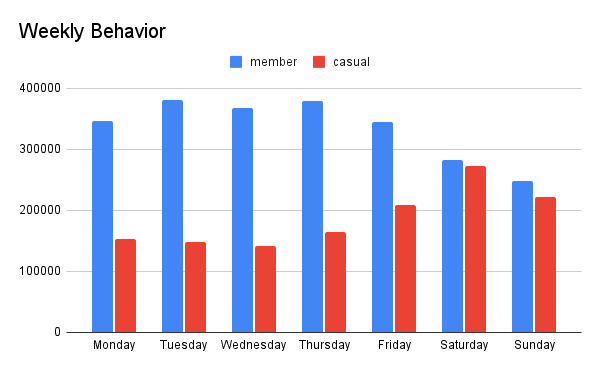
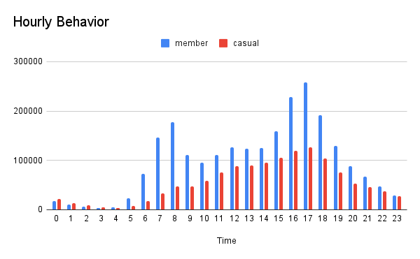
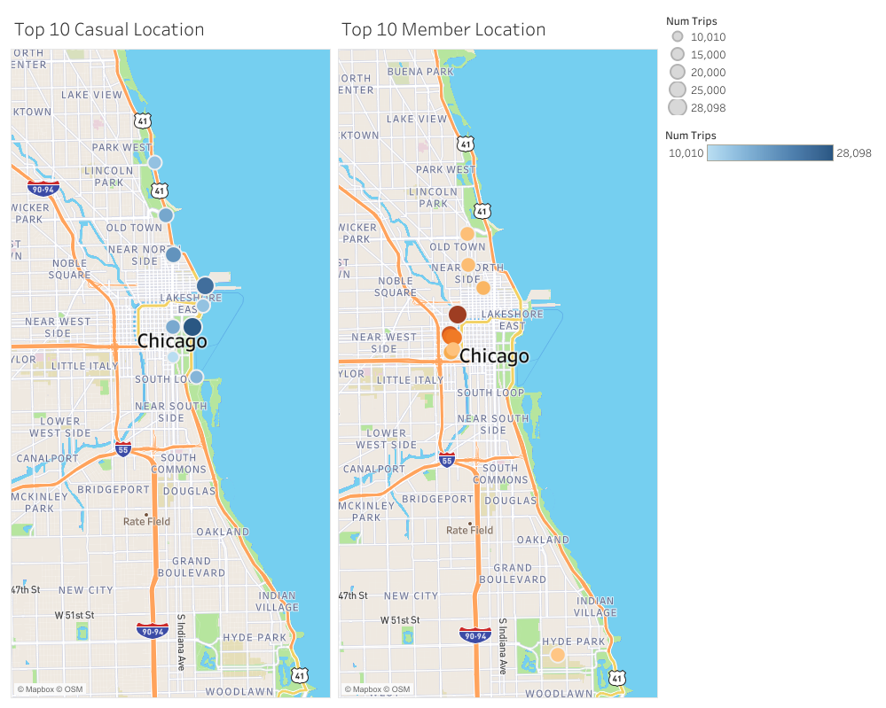
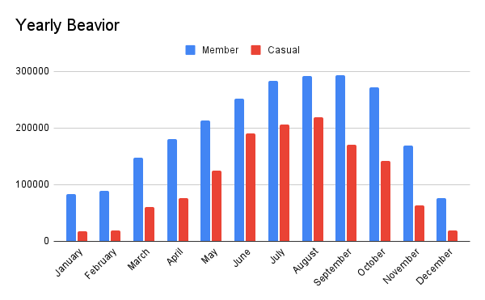

# Google-Data-Analytics-Capstone-Project-Cyclistic-Case-Study

## Introduction

This project is part of the capstone project in the Google Data Analytics course

### Scenario & Problem Statement

**Cyclistic** is a bike-share company in Chicago with 692 stations and over 5,800 bikes. Our finance team recently found that annual members are much more profitable than casual riders. Because of this, Moreno, the Head of Marketing Analytics, wants to create a campaign to encourage casual riders to become members.

To do this, we need to understand three things: how the two groups use the bikes differently, why a casual rider might join, and how digital media can help our strategy. 

As a junior data analyst, my job is to focus on the first part: **How do annual members and casual riders use the service differently?**

## Data Preparation

### Data Source

I am using the last 12 months of customer ride data provided by the course. The files are currently saved on my computer in the dedicated case study folder

### Data Organization

The data was originally organized by month in zip files, using the naming convention **YYYYMMDD-divvy-trip**. After I uploaded the data to BigQuery, I renamed the tables to **YYYY_MM_cyclistic_trips** to keep everything consistent.

Each table contains **13 columns** with consistent data types. The structure is the same across all files, including key information like ride IDs, start and end times, station names, and coordinates. The final column, `member_casual`, is what I will use to distinguish between the two types of riders.

## Data Processing

After uploading all the tables, I combined them to create a full year of trip data. I also added a new column called `source_month` to keep track of the original files. I named this final table **2025_trips**.

### Data Cleaning

- Excluded 29 records with illogical timestamps (where the start time was after the end time).
- Filtered out trips shorter than one minute or longer than 24 hours to remove outliers.
- Removed rows with missing station names to ensure data quality.
- Deleted 1,961,630 rows in total during the cleaning process.
- Final Dataset: This left me with 3,591,364 rows ready for analysis.

## Analysis

The main business question asks how annual members and casual riders use the service differently. To answer this, I will **examine their behavior** across the following categories:
- **Frequency**: How often does each group use the bikes?
- **Duration**: What is the average length of their rides?
- **Day of the Week**: Do they prefer riding on weekdays or weekends?
- **Time of Day**: At what times are they most active?
- **Location**: Which stations are the most popular for each group?

### Findings

On average, **annual members** complete 6,424 rides per day, while **casual riders** complete 3,579. Although members use the service more frequently, **casual riders actually ride 84% longer** per trip than members do.

Our analysis of riding patterns shows several key differences:
- **Weekly Patterns**: Annual members' activity **peaks during the week** and declines over the weekend. In contrast, casual ridership is lower on weekdays but **surges on weekends**.

  
  
- **Hourly Behavior**: Member usage **peaks sharply during commuting hours** (8 AM and 5 PM). However, casual ridership grows steadily throughout the day, **peaking in the late afternoon**.

  
  
- **Popular Locations**: The top 10 start locations for casual riders are in **recreational areas**, such as Navy Pier. Meanwhile, annual members start their rides near **residential areas, offices, and transit hubs**.

- **Seasonal Trends**: While both groups peak in the summer, members stay active longer into the year. **Member usage remains strong through October, whereas casual ridership begins to drop earlier**, starting in September.

## Conclusion

In summary, our analysis shows two very different types of users:

- **Casual Riders**: These users mainly use Cyclistic for **recreation**. This is shown by their increased activity on weekends, longer average ride times, and starting points near tourist spots and recreational areas.

- **Annual Members**: These users primarily use the service for **commuting**. We can see this in their high usage during "rush hours" (7–9 AM and 4–6 PM) on weekdays. They generally have shorter ride durations and start their trips near offices, residential areas, or transit hubs.

## Recommendation

Based on my analysis, I recommend the following marketing strategies:

- **Introduce a "First-Year" Discount**: Offer a 30-day free trial or a discounted price for the first year. This reduces the risk for casual riders who are considering a full membership.

- **Target High-Traffic Locations**: Focus digital advertisements and physical promotions at the **top 10 recreational stations** (like Navy Pier), where casual riders are most active.

- **Create Seasonal Membership Options**: Since casual riders are most active during the summer and on weekends, consider launching **"Weekend Passes"** or **"Summer-Only"** memberships to bridge the gap to a full annual plan.

- **Highlight the Savings**: Perform a **cost-benefit analysis** to show casual riders how much money they could save by switching to an annual membership. This data can be a powerful tool for our promotional campaigns.
